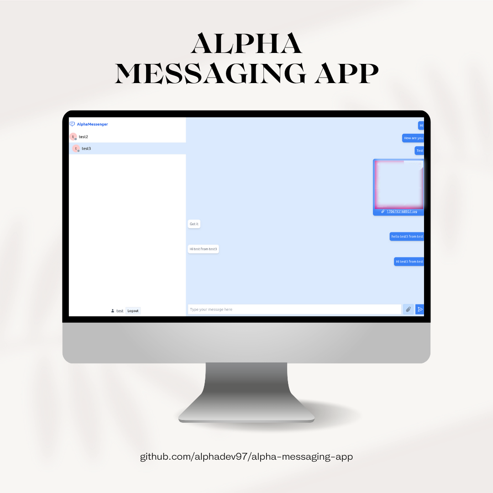

# Alpha Messaging App - MERN

[](https://opensource.org/licenses/MIT)



## Description

Alpha Messaging App is a simple full-stack messaging application built with Express.js, MongoDB, and React. It provides users with the ability to sign up, communicate with each other in real-time, and share images.

## Table of Contents

- [Features](#features)
- [Technologies Used](#technologies-used)
- [Project Structure](#project-structure)
- [Setup and Installation](#setup-and-installation)
- [Running the App](#running-the-app)
- [Backend](#backend)
- [Frontend](#frontend)
- [Contribution](#contribution)
- [License](#license)

## Features

- **Real-time Messaging**: Utilizes WebSocket for instant communication.
- **Online/Offline Indicator**: Shows the online status of users.
- **File Sharing**: Users can share images with each other.

---

## Technologies Used

### Backend

- **Express.js**: Web application framework for Node.js.
- **MongoDB**: A NoSQL database for storing user and message data.
- **WebSocket (ws)**: A library for adding WebSocket support to your Node.js HTTP server.

### Frontend

- **React**: A JavaScript library for building user interfaces.
- **React Router**: A library for handling navigation in React applications.
- **Axios**: A promise-based HTTP client for making API requests.
- **WebSocket**: A communication protocol providing full-duplex communication channels over a single TCP connection.

---

## Project Structure

- **`backend`**: Contains the Express.js server code.
- **`frontend`**: Houses the React frontend application.

---

## Setup and Installation

### Backend

1. Navigate to the `backend` folder:

   ```bash
   cd backend
   ```

2. Install dependencies:

   ```bash
   npm install
   ```

3. Set up environment variables:

   Create a `.env` file in the root of the `backend` folder with the following content:

   ```env
   MONGO_URL=
   JWT_SECRET_KEY=
   CLIENT_URL=
   ```

### Frontend

1. Navigate to the `frontend` folder:

   ```bash
   cd frontend
   ```

2. Install dependencies:

   ```bash
   npm install
   ```

---

## Running the App

### Backend

Run the backend server:

```bash
npm run dev
```

### Frontend

Start the development server:

```bash
npm run dev
```

Open your browser and navigate to http://localhost:3000 to view the app.

---

## Contribution

Feel free to contribute to the project. If you have ideas for improvements or find any issues, please open an issue or submit a pull request.

## License

This project is licensed under the [MIT License](https://github.com/alphadev97/alpha-messaging-app/blob/main/LICENSE).

## Note

**This app is not deployed yet**. I'm planning to enhance the application further by scaling it, updating the UI for a better user experience, implementing advanced data storage solutions, integrating Google authentication, and adding more exciting features.
